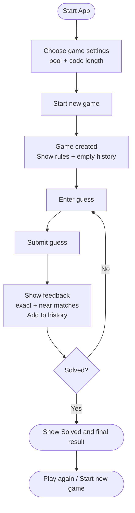

## Introduction

This document captures the Phase 1 design artifacts for a Java-based client of the Codebreaker Solitaire REST API. The focus in this phase is on **requirements and user-facing behavior**, describing *what* the application does from a player’s perspective rather than *how* it is implemented. These artifacts are intentionally implementation-agnostic to support future UI transitions from a console application to JavaFX and Android.

The sections below describe the complete game lifecycle, expected error handling, and user stories that define successful interaction with the system. Together, they establish a shared understanding of gameplay flow, user expectations, and system responsibilities that will inform later phases focused on separation of concerns and class design.

## Flowchart

## Error States & Expected Application Behavior

| Scenario | HTTP Status | Likely Cause | User-Facing Message | Application Response |
|--------|-------------|--------------|---------------------|----------------------|
| Invalid game configuration | 400 Bad Request | Empty pool, unsupported code length | “Game settings are invalid. Please check the pool and length.” | Highlight invalid fields and allow user to correct input |
| Guess with wrong length | 400 Bad Request | Guess length does not match code length | “Your guess must be exactly **N** characters long.” | Preserve input, show error, and allow immediate correction |
| Guess contains invalid characters | 400 Bad Request | Guess includes characters not in the pool | “Your guess contains characters not in the pool.” | Block submission, identify issue, and allow correction |
| Game not found | 404 Not Found | Invalid or deleted game ID | “This game could not be found.” | Return user to game setup screen with option to start a new game |
| Game already solved | 409 Conflict | Guess submitted after solution found | “This game has already been solved.” | Disable guess input and prompt user to start a new game |
| Network or server failure | 5xx / Network error | Server unavailable or connectivity issue | “Unable to reach the server. Please try again.” | Keep current screen state and offer retry without data loss |

# Phase 1 – User Stories
## Codebreaker Solitaire Client

This document captures user stories describing the expected behavior of the Codebreaker Solitaire game client from the player’s perspective. These stories focus on *what* the system does, not how it is implemented.

---

## Complete Game Loop

- **As a player**, I want to start a new game by choosing a character pool and code length, **so that** I can begin a fresh puzzle with clear rules.

- **As a player**, I want to submit guesses repeatedly and receive exact-match and near-match feedback after each guess, **so that** I can logically refine my future guesses.

- **As a player**, I want to see a history of my previous guesses and their results, **so that** I can track progress without relying on memory.

- **As a player**, I want the game to clearly notify me when the code has been solved and show the final result, **so that** I know the game is complete.

- **As a player**, I want to start a new game immediately after finishing or abandoning one, **so that** I can continue playing without restarting the application.

---

## Unicode Flexibility

- **As a player**, I want the UI to clearly explain that the character pool can include any Unicode characters I can type (letters, symbols, emoji), **so that** I understand I’m not limited to alphanumeric characters.

- **As a player**, I want the UI to show a live guess-length indicator that matches how the game counts characters, **so that** visually ambiguous Unicode characters do not cause accidental invalid guesses.

- **As a player**, I want the application to validate that every character in my guess exists in the selected pool before submission, **so that** I can correct mistakes immediately.

---

## Error Handling & Recovery

- **As a player**, if I submit a guess with an incorrect length, I want a clear error message explaining the required length while preserving my input, **so that** I can quickly fix the mistake. *(400 – invalid guess)*

- **As a player**, if I attempt to submit a guess after the game has already been solved, I want the app to prevent further guesses and guide me toward starting a new game, **so that** I don’t become confused. *(409 – game already solved)*

- **As a player**, if a game I am trying to access does not exist, I want the app to explain that the game cannot be found and provide a path to start a new one, **so that** I can recover gracefully. *(404 – game not found)*

- **As a player**, if I provide invalid settings when creating a game (such as an empty pool or unsupported length), I want the UI to highlight the problem and explain how to fix it, **so that** I can successfully start a game. *(400 – invalid game configuration)*

- **As a player**, if the server or network is temporarily unavailable, I want a friendly error message and the ability to retry without losing my current screen state, **so that** transient failures do not ruin the experience.

---
