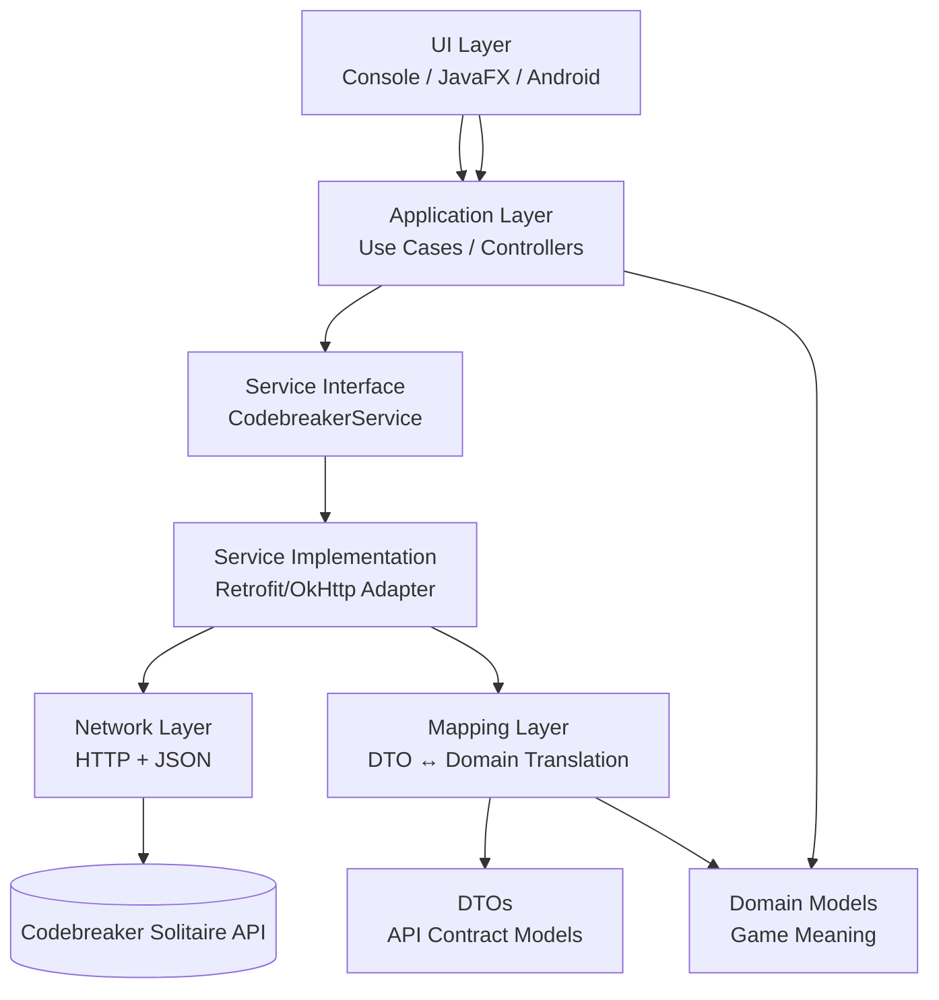

# HTTP Client Library Strategy

The choice of HTTP client library affects not only how API requests are made, but also how portable and maintainable the application will be as it evolves from a console-based Java program to JavaFX and Android. To preserve separation of concerns, the networking implementation should be hidden behind a service interface so that UI and domain logic remain unaffected by library changes. The table below compares three common options with a focus on long-term Android compatibility.

| Library | Strengths | Limitations | Android Suitability |
|-------|-----------|-------------|---------------------|
| `java.net.http.HttpClient` | Part of the standard JDK; no external dependencies; good for desktop and server JVMs | Not natively supported on Android; requires additional tooling or workarounds | Low |
| OkHttp | Mature, stable, widely used; excellent performance and TLS handling; works on desktop and Android | Lower-level API; manual request/response and JSON handling | High |
| Retrofit2 (with OkHttp) | High-level, type-safe API definitions; built-in JSON conversion; strong Android ecosystem support | Additional abstraction and conventions to learn | Very High |

### Conclusion:  
Given the requirement to support a future migration to Android, Retrofit2 (built on OkHttp) is the optimal choice. It provides strong long-term ecosystem support, simplifies API integration through typed interfaces and JSON mapping, and aligns well with separation of concerns by allowing networking details to remain isolated from UI and domain logic.

# JSON Mapping Strategy: Domain Models vs DTOs

Because this client communicates with a REST API that it does not control, the design must assume that the JSON contract may change over time (for example, new fields, renamed fields, different nesting, or modified error payloads). If core domain objects mirror the JSON structure exactly, changes to the API would propagate directly into game logic and UI code, weakening separation of concerns.

### Recommendation: Use DTOs with a Mapping Layer

The recommended approach is to introduce **Data Transfer Objects (DTOs)** that represent the API contract, alongside separate **domain models** that represent the internal concepts of the game. A dedicated mapping layer translates between DTOs and domain objects. This creates a protective boundary: API changes are largely isolated to DTOs and mapping logic, while the rest of the application remains stable.

### Where the Boundary Goes (Separation of Concerns)

Responsibilities should be divided as follows:

- **Network layer**: Handles HTTP communication and JSON serialization/deserialization into DTOs
- **Mapping layer**: Converts DTOs to domain models and domain models to request DTOs
- **Domain layer**: Represents game concepts such as game state, guesses, results, and solved status
- **UI layer**: Displays and interacts with domain models only, never raw JSON or DTOs

This structure ensures that UI technologies (console, JavaFX, Android) remain decoupled from API details.

### What Should Be Identical vs. Different?

As a guiding principle:

- Structures that primarily exist to satisfy transport or protocol concerns (timestamps, IDs, nested resources, error payload shapes) should remain in **DTOs**.
- Structures that represent gameplay meaning or user-facing concepts (guess results, game status, history entries) should exist as **domain models**.

This distinction keeps the domain expressive and resilient, while allowing the API contract to evolve independently.

# CodebreakerService Interface (UI-Agnostic API Boundary)

To enforce separation of concerns, the application should centralize all communication with the Codebreaker Solitaire API behind a single, UI-agnostic service boundary: `CodebreakerService`. This interface defines *what* operations the client supports (start game, retrieve state, submit guesses, delete games) without exposing *how* those operations are implemented (Retrofit/OkHttp, HTTP details, JSON parsing).

By combining this service boundary with DTO/domain mapping, the UI layers (console, JavaFX, Android) can depend only on stable domain-facing operations and consistent error categories. The sections below illustrate the intended layering, the service interface contract, and the service-level error taxonomy used to keep transport concerns isolated from the rest of the application.



The following interface defines the service boundary illustrated above. It specifies the operations available to the application while remaining independent of any UI framework or HTTP client implementation.

```java
/**
 * CodebreakerService defines all interactions with the Codebreaker Solitaire API.
 *
 * This interface is UI-agnostic and hides all transport, HTTP, and JSON details.
 * Implementations may use Retrofit, OkHttp, or other HTTP clients.
 */
public interface CodebreakerService {

    // -------- Game lifecycle --------

    /**
     * Starts a new game using the provided configuration.
     *
     * @param config game configuration (character pool, code length)
     * @return a summary of the newly created game
     * @throws InvalidGameConfiguration
     * @throws NetworkUnavailable
     * @throws ServerError
     */
    GameSummary startGame(GameConfig config);

    /**
     * Retrieves the current state of a game.
     *
     * @param gameId unique game identifier
     * @return current game state
     * @throws GameNotFound
     * @throws NetworkUnavailable
     * @throws ServerError
     */
    GameState getGame(String gameId);

    /**
     * Deletes a game and all associated guesses.
     *
     * @param gameId unique game identifier
     * @throws GameNotFound
     * @throws NetworkUnavailable
     * @throws ServerError
     */
    void deleteGame(String gameId);

    // -------- Guess lifecycle --------

    /**
     * Submits a guess for the specified game.
     *
     * @param gameId unique game identifier
     * @param guessText the guessed code
     * @return the outcome of the guess
     * @throws GameNotFound
     * @throws GameAlreadySolved
     * @throws InvalidGuessLength
     * @throws InvalidGuessCharacters
     * @throws NetworkUnavailable
     * @throws ServerError
     */
    GuessOutcome submitGuess(String gameId, String guessText);

    /**
     * Retrieves a previously submitted guess.
     *
     * @param gameId unique game identifier
     * @param guessId unique guess identifier
     * @return the outcome of the guess
     * @throws GameNotFound
     * @throws NetworkUnavailable
     * @throws ServerError
     */
    GuessOutcome getGuess(String gameId, String guessId);
}
```

## Service-Level Error Categories

The `CodebreakerService` should translate low-level HTTP, network, and JSON errors into a small, well-defined set of service-level error categories. These categories represent *meaningful failure states* from the application’s perspective and allow UI layers to respond consistently without depending on transport details.

### Game Lifecycle Errors
- **GameNotFound**  
  The specified game ID does not exist or has been deleted.

- **InvalidGameConfiguration**  
  The requested game settings (character pool or code length) are invalid or unsupported.

- **GameAlreadySolved**  
  An operation (such as submitting a guess) was attempted on a game that has already been completed.

### Guess Validation Errors
- **InvalidGuessLength**  
  The submitted guess does not match the required code length for the game.

- **InvalidGuessCharacters**  
  The submitted guess contains one or more characters that are not part of the game’s character pool.

### Infrastructure & Communication Errors
- **NetworkUnavailable**  
  The service could not be reached due to connectivity issues.

- **ServerError**  
  The server responded with an unexpected failure (5xx), indicating a problem outside the client’s control.

- **UnexpectedResponse**  
  The server response could not be interpreted (malformed JSON, missing required fields, incompatible API change).

### Design Intent
These error categories form part of the `CodebreakerService` contract.  
They ensure:
- UI layers never need to inspect HTTP status codes
- Domain and UI logic remain stable if transport details change
- Error handling remains consistent across console, JavaFX, and Android clients

