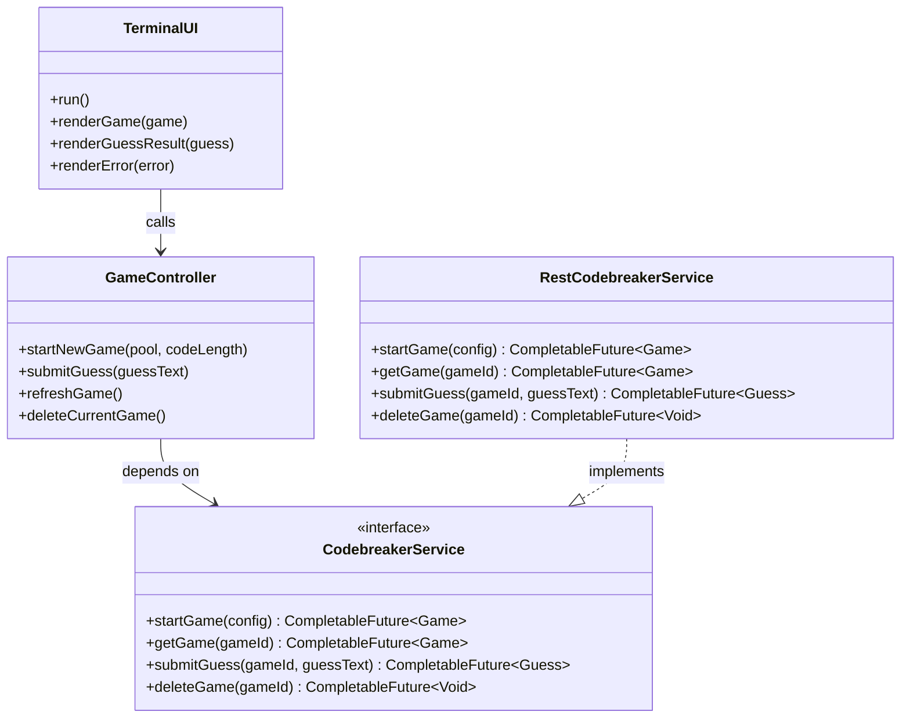

## Phase 3: Class Design (Bird’s-Eye View)

This section defines the high-level structure of the Codebreaker Solitaire client by identifying the core classes, their responsibilities, and their relationships. The goal is to establish a clear “bird’s-eye view” of the system that highlights the main nouns (domain objects) and verbs (operations) without committing to implementation details.

By organizing classes into well-defined layers and using asynchronous service boundaries, this design supports responsive UIs and smooth evolution from a terminal-based client to JavaFX and Android while preserving separation of

## Domain Modeling

### UI layer
- **TerminalUI** — Collects player input and renders game state and messages in a console-friendly way; delegates all actions to the controller.

### Application / controller layer
- **GameController** — Orchestrates the game loop (start game, submit guess, fetch state) and coordinates async completion to update the UI without blocking.

### Domain layer
- **Game** — Represents the player-visible game state (settings, solved status, guess history, optional revealed solution).
- **Guess** — Represents a single player guess and its evaluation result (score and solution flag).
- **Score** — Encapsulates exact and near match counts and provides lightweight convenience queries (e.g., “is solution” when exact matches equals code length).
- **GameStatus** *(optional enum)* — Expresses coarse game state (IN_PROGRESS, SOLVED) to simplify UI rendering decisions.

### Service / network layer
- **CodebreakerService** — UI-agnostic boundary for all remote operations, returning `CompletableFuture<T>` so callers can attach callbacks and avoid blocking.
- **RestCodebreakerService** — Concrete implementation of `CodebreakerService` using an HTTP client stack (Retrofit/OkHttp internally), hidden from the rest of the app.

### Mapping / DTO layer
- **DTOs** *(e.g., GameDto, GuessDto, ApiErrorDto)* — Mirror the API contract for JSON serialization/deserialization.
- **Mapper** *(e.g., CodebreakerMapper)* — Translates DTOs ⇄ domain models, insulating domain/UI from API shape changes.

---

## Class Signatures (Domain Only — No Method Bodies)

```java
public class Game {
    // ---- Fields ----
    private final String gameId;
    private final String pool;
    private final int codeLength;
    private boolean solved;
    private String revealedSolutionText; // optional; may be null if unknown/not provided
    private final List<Guess> guessHistory;

    // ---- Constructors ----
    public Game(String gameId, String pool, int codeLength);

    // ---- Accessors ----
    public String getGameId();
    public String getPool();
    public int getCodeLength();
    public boolean isSolved();
    public Optional<String> getRevealedSolutionText();
    public List<Guess> getGuessHistory();

    // ---- Convenience / Domain behaviors (signatures only) ----
    public void addGuess(Guess guess);
    public Optional<Guess> getLatestGuess();
    public Optional<Score> getLatestScore();
    public int getGuessCount();
    public void markSolved(String revealedSolutionText);
}

public class Guess {
    // ---- Fields ----
    private final String guessId;        // may be null/absent until persisted by API
    private final String text;
    private final Score score;
    private final boolean solution;      // true if this guess solves the game

    // ---- Constructors ----
    public Guess(String text, Score score, boolean solution);
    public Guess(String guessId, String text, Score score, boolean solution);

    // ---- Accessors ----
    public String getGuessId();
    public String getText();
    public Score getScore();
    public boolean isSolution();
}

public class Score {
    // ---- Fields ----
    private final int exactMatches;
    private final int nearMatches;

    // ---- Constructors ----
    public Score(int exactMatches, int nearMatches);

    // ---- Accessors ----
    public int getExactMatches();
    public int getNearMatches();

    // ---- Convenience (signatures only) ----
    public boolean isPerfectForLength(int codeLength);
}
```

## Async Service Interface (CompletableFuture — No Implementation)
```java
/**
 * UI-agnostic boundary for all Codebreaker Solitaire API communication.
 * Implementations must not block the UI thread; all operations return CompletableFuture.
 */
public interface CodebreakerService {

    CompletableFuture<Game> startGame(GameConfig config);

    CompletableFuture<Game> getGame(String gameId);

    CompletableFuture<Guess> submitGuess(String gameId, String guessText);

    CompletableFuture<Guess> getGuess(String gameId, String guessId);

    CompletableFuture<Void> deleteGame(String gameId);
}

/**
 * Minimal configuration for creating a new game.
 * (Kept intentionally small and UI-agnostic; details can be expanded in later phases.)
 */
public class GameConfig {
    private final String pool;
    private final int codeLength;

    public GameConfig(String pool, int codeLength);

    public String getPool();
    public int getCodeLength();
}
```

## Service-Level Errors (Represented at the Boundary)

Service failures should be exposed as typed, service-level errors by completing the CompletableFuture exceptionally. The UI/controller layer can handle these using exceptionally(...), handle(...), or similar callback mechanisms.

```java
/**
 * Base type for service-level failures. Concrete subtypes represent meaningful categories.
 * (No implementation here; types only.)
 */
public abstract class CodebreakerServiceException extends RuntimeException {
    public CodebreakerServiceException(String message);
}

/** Game not found (e.g., invalid gameId). */
public class GameNotFoundException extends CodebreakerServiceException {
    public GameNotFoundException(String message);
}

/** Invalid game configuration (e.g., empty pool, unsupported length). */
public class InvalidGameConfigurationException extends CodebreakerServiceException {
    public InvalidGameConfigurationException(String message);
}

/** Guess submitted after a game is already solved. */
public class GameAlreadySolvedException extends CodebreakerServiceException {
    public GameAlreadySolvedException(String message);
}

/** Guess length mismatch. */
public class InvalidGuessLengthException extends CodebreakerServiceException {
    public InvalidGuessLengthException(String message);
}

/** Guess contains characters not in the pool. */
public class InvalidGuessCharactersException extends CodebreakerServiceException {
    public InvalidGuessCharactersException(String message);
}

/** Network unavailable or connectivity failure. */
public class NetworkUnavailableException extends CodebreakerServiceException {
    public NetworkUnavailableException(String message);
}

/** Server-side failure or unexpected API response. */
public class ServerErrorException extends CodebreakerServiceException {
    public ServerErrorException(String message);
}
```

The diagram below illustrates the primary class relationships and dependencies in the system. It highlights how the UI, controller, and service layers interact asynchronously while preserving clear separation of concerns.

